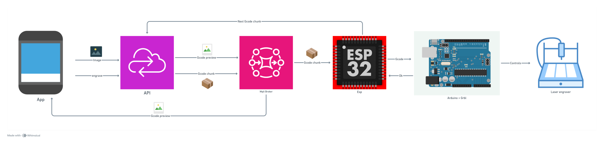
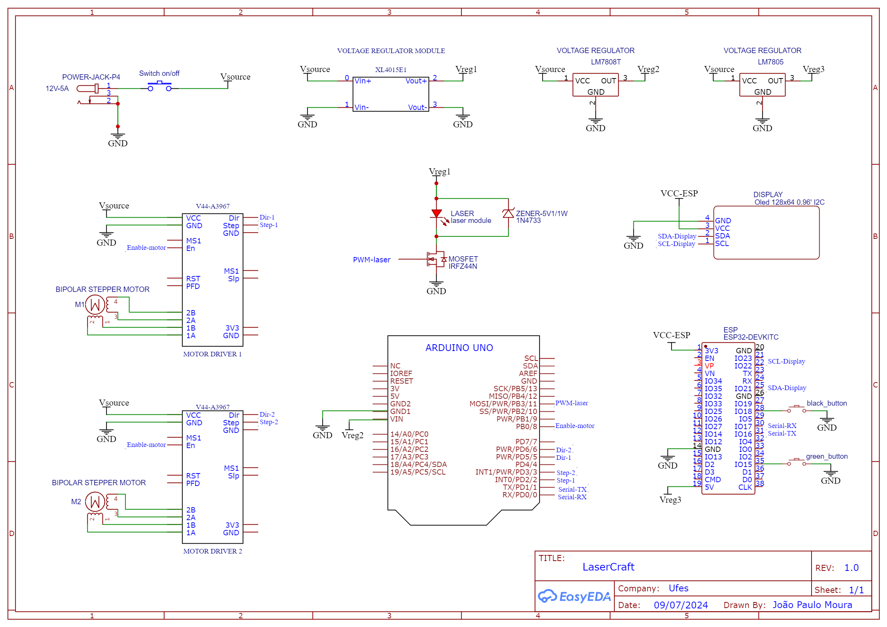
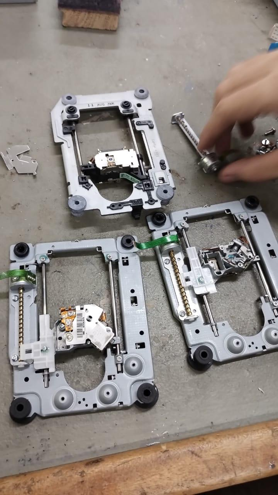
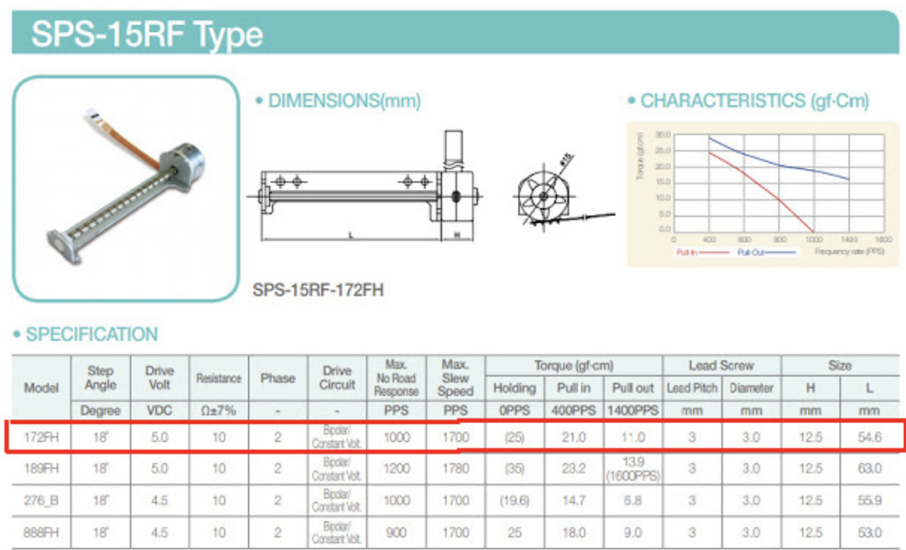

# Project documentation

## Overview
Before starting the details, let's check the overview of the system.
This is a project of a laser engraver CNC machine controlled by a mobile app and cloud computing. It's divided in 3 parts: remote API, mobile app and the embedded system. Let's check the flow of operation:
 - First you must open the mobile app, choose a PNG image from your gallery or take a picture within the app.
 - The app will send the corresponding image for the remote api via **http**.
 - The image will be processed by some filters and the preview will return to the app.
 - In the app you will click to engrave the image and then, the api will translate the image to [Gcode](https://en.wikipedia.org/wiki/G-code) and publish it in a **mqtt** topic.
 - An ESP32 subscribed in the topic will receive the Gcode and then send it to the Arduino via Serial UART.
 - The Arduino is hosting the firmware which will control the hardware through Gcode.

This document explains how we've projected the laser engraver in both aspects: **Hardware** and **Software**.

## Software
Before we start diving deeper into how the project works under the hood, let's
have a look at how the projet works as a whole:

Here, we can see that the [mobile app](../app/README.md) first sends an image to the [api](../api/README.md), where it
gets processed and turned into [Gcode](https://en.wikipedia.org/wiki/G-code)
that will be used later on to control the laser engraver.

Furthermore, the [api](../api/README.md) publishes a preview of the gcode into a mqtt topic. The [app](../app/README.md)
then listens on this topic and shows the preview to the user that can then
either send a new image or engrave the one he got.

When the user asks to engrave the image, the [app](../app/README.md) calls into another route on the
[api](../api/README.md) that starts to publish the [Gcode](https://en.wikipedia.org/wiki/G-code)
into another mqtt topic.

In this project, it was necessary to split the
[Gcode](https://en.wikipedia.org/wiki/G-code) into chunks, since depending on
the image size, the gcode can get quite big so the ESP32 buffer couldn't handle
it.

Once the [api](../api/README.md) publishes the first [Gcode](https://en.wikipedia.org/wiki/G-code)
chunk into the topic, the ESP32 listens on the topic and starts to send it, line
by line to the Arduino with the GRBL firmware, that controls the engraver,
setting its position on the x-y axis, turning on and off the laser etc.

The firmware then returns a status code back to the ESP32, letting it know the
command has been successfully executed. Then the ESP32 sends the
next line.

When the ESP32's buffer has been fully consumed, it publishes into another mqtt
topic, asking for the next [Gcode](https://en.wikipedia.org/wiki/G-code) chunk. Then, the [api](../api/README.md) publishes the next chunk and the same idea goes until the whole [Gcode](https://en.wikipedia.org/wiki/G-code)
is sent.

## Hardware
The hardware design for this project depends on the CNC controller you will choose. In this way, we have chosen the [GRBL V1.1](https://github.com/gnea/grbl). It's a firmware that translates **Gcode** into signals for stepper motor movements and laser activation. Sure, let's proceed with the list of materials based on that:

### List
 - 1x Arduino UNO board
 - 1x ESP32 board
 - 1x PCB perfboard 15x15
 - 1x P4 Jack
 - 1x 12V 5A Power supply
 - 1x LM7805 voltage regulator
 - 1x LM7808 voltage regulator
 - 1x XL4015 voltage regulator module
 - 1x Laser 650nm 250mW
 - 2x Easydriver V44 A3967
 - 1x Display Oled I2C 128x64 0.96'
 - 1x On/Off switch
 - 2x Normally open button
 - 1X IRFZ44N mosfet
 - 2x DVD Stepper motor
 - Wires
 - Some terminal blocks

#
### Schematic

#
### Stepper motors
In our case, we have encountered some old DVD drivers with the stepper motors, but you can use other stepper motors like Nemma-17 for example. The good part of DVD stepper motors is that it comes with structure and rails that will be used in the project. 

Below there's the specification of the stepper motor:

This image contains some informations that will be used to calibrate the GRBL later. For example: the step angle of the motor is 18º. In this way, for a complete  revolution (360º), you will need 20 steps. The lead pitch is important too. It says about linear distance the carriage travels in one revolution.

#
### Arduino and GRBL
You can check how GRBL works [here](https://github.com/gnea/grbl/wiki). However, I will talk about some important details below.

#### *Before flashing*
Before flashing the GRBL to the Arduino, you must modify some details that will be defined in compile time. These datails concern about **two axis system operation**. Check [this](https://github.com/gnea/grbl/wiki/Two-Axis-System-Considerations) topic first. After that, you must [upload](https://github.com/gnea/grbl/wiki/Compiling-Grbl) GRBL.

#### *Using GRBL*
After adjusting the details and uploading the GRBL to the Arduino, you can communicate with it by Serial monitor at Arduino IDE. Set the baud rate to 115200 and check the commands in the [documentation](https://github.com/gnea/grbl/wiki/Grbl-v1.1-Commands). Backing to the hardware project, below there's the pinout for Aruino with GRBL.

For this project we only use the following pins: 0, 1, 2, 3, 5, 6, 8 and 11.
**The pins 0 and 1 are used for serial communication with ESP32.**
**The pin 11 is used for laser activation.**

#### *Laser mode and calibration*
Let's activate the laser mode. GRBL has a lot of environment variales stored in EPROM. These variables control set parameters and control some behaviors of the firmware. For laser mode we must set the \$32 flag to **\$32=1**. Check more details [here](https://github.com/gnea/grbl/wiki/Grbl-v1.1-Laser-Mode).

We also must set other flags like steps/mm ([Configuring GRBL flags](https://github.com/gnea/grbl/wiki/Grbl-v1.1-Configuration)). This parameter depends on the stepper motor parameters as I said above. We can calculate it by:
**steps_per_mm = (steps_per_revolution*microsteps)/mm_per_rev**

Microsteps depends on the Easydriver configuration. Check the next section.  

#
### Motor driver
The Easydriver V44 A3967 is an easy way to controll the stepper motor. You just need to connect some pins to the Arduino and it works magically. Check the connections in the schematic. 

#### *Microstepping*
This driver has 4 modes of microstepping that can be checked [here](https://www.schmalzhaus.com/EasyDriver/). The default is 1/8. It means that you need 8 microsteps to complete 1 normal step. It will be used to calculate the steps/mm in the section above. 

#
### Laser connection
The laser works around 5V. However, we can't connect it directly to the pin11 of Arduino. The current it drains is so high and it would ruin the microcontroller. In this way, we chose to use a MOSFET. The PWM from pin11 connected to the gate of transistor will turn on the drain-source junction and power the laser.

#### *IRFZ44N*
This is the chose mosfet. The datasheet is [here](https://www.infineon.com/dgdl/Infineon-IRFZ44N-DataSheet-v01_01-EN.pdf?fileId=5546d462533600a40153563b3a9f220d). You can choose a simpler one, because this is oversized. We wanted to make sure it wouldn't burn. 

#### *Voltage regulator module XL4015*
This module has a trimpot to regulate the voltage from the output. Testing the laser with the mosfet, we've got a 5.33V output in the regulator to a 4.95V voltage drop across the laser (connecting laser between regulator and mosfet drain like in the schematic).

*We've used three voltage regulators in this project because the Arduino VIN pin works with voltages between 7 and 12V, the ESP32 works at exactly 5V, and the laser module needs a slightly higher voltage to work properly (5.33V). However, if you want to reproduce this project, do your own tests with the laser module, transistor, and voltage regulators, because the laser works between 3V and 5V and you can damage it with incorrect voltages. You might use the same voltage regulator for both the ESP32 and the laser module. We have used the XL4015 to test the exact voltage across the laser with trimpot regulation.*

#
### Power supply
In the beginning of the project, we chose to use a 12V 5A power supply to ensure there would be enough current and to stay within a good voltage range for the motor driver, which operates from 7 to 30V. We believe that you could use a 12V 3A power supply and it will work fine.

#
### PCB perfboard 15x15
To solder the components and make good use of the project structure's space, we chose to buy a 15cmx15cm perfboard. However, it is entirely possible to reduce the size of the board if necessary, as there is plenty of space left between the components.

#
### Buttons
The buttons were used to control some actions within the application like change the display mode or reset the engraving.

